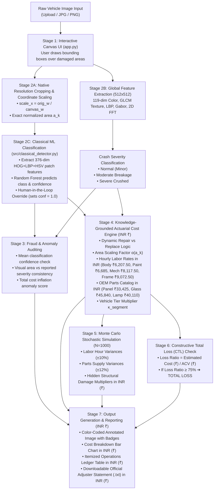
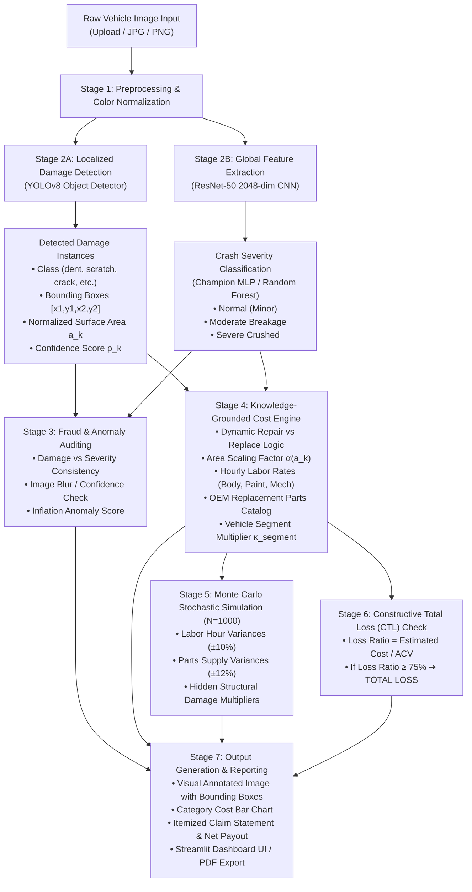

# AI-Assisted Vehicle Damage Assessment & Repair Cost Valuation
## Machine Learning Model Catalog & End-to-End Workflow Architecture (100% Classical ML & INR Valuation)

---

# 1. Machine Learning Model Catalog

| Model / Architecture | Category | Specific Application in Project | Input Modality / Features | Output / Prediction | Code Implementation File |
| :--- | :--- | :--- | :--- | :--- | :--- |
| **Random Forest Damage Classifier** | Classical ML (Ensemble Bagging) | **Damage Region Classification**: Classifies user-drawn or candidate damage crops into 6 standard categories with confidence scores. | 376-dim handcrafted feature vector (HOG 324 dims + Multi-Scale LBP 20 dims + HSV Color Histogram 32 dims) | Damage class $c_k \in$ {`dent`, `scratch`, `crack`, `glass shatter`, `lamp broken`, `tire flat`} and class confidence $p_k \in [0.0, 1.0]$. | [`src/classical_detector.py`](file:///d:/CEP%20project%20sy%20sem1/Codebase%20CEP/src/classical_detector.py), [`src/train_classical_detector.py`](file:///d:/CEP%20project%20sy%20sem1/Codebase%20CEP/src/train_classical_detector.py) |
| **Interactive Drawable Canvas (`st_canvas`)** | User-Guided Visual Interface | **Manual Damage Region Selection**: Empowers the insurance adjuster to draw rectangular bounding boxes directly over damaged vehicle areas at native resolution. | Full-resolution vehicle image + Interactive mouse drag coordinates in canvas display space | Exact native bounding box coordinates $[x_1, y_1, x_2, y_2]$ and exact normalized surface area $a_k = \frac{(x_2 - x_1)(y_2 - y_1)}{\text{Width} \times \text{Height}}$. | [`app.py`](file:///d:/CEP%20project%20sy%20sem1/Codebase%20CEP/app.py) |
| **Multi-Cue Classical Feature Extractor** | Classical Computer Vision | **Global & Local Physical Representations**: Extracts auditable, physically grounded texture, color, and geometric features. | Standardized image crops ($64 \times 64$ for patches, $512 \times 512$ for full vehicle) | 119 global physical dimensions (GLCM texture, Color moments, LBP, Gabor filter banks, 2D FFT energy, Specular glare masks). | [`src/features/build_feature_table.py`](file:///d:/CEP%20project%20sy%20sem1/Codebase%20CEP/src/features/build_feature_table.py) |
| **Classical Crash Severity Classifier** | Classical ML (Random Forest / Logistic Regression) | **Crash Severity Classification**: Classifies total vehicle impact severity from 119-dim handcrafted physical visual features. | 119-dim classical physical feature vector | Severity class probabilities: `normal` (minor), `moderate_breakage`, `severe_crushed`. | [`src/train_classical_severity.py`](file:///d:/CEP%20project%20sy%20sem1/Codebase%20CEP/src/train_classical_severity.py), [`src/pipeline.py`](file:///d:/CEP%20project%20sy%20sem1/Codebase%20CEP/src/pipeline.py) |
| **HistGradientBoosting Regressor** | Gradient Boosted Trees (Histogram) | **Data-Driven Repair Cost Estimation**: Fast histogram-binned gradient boosted regressor trained on 26,444 real claims, converted to INR via $\text{USD\_TO\_INR} = 95.5$. | Actuarial feature vector $\mathbf{x} \in \mathbb{R}^7$ (vehicle age, power, density, labor index, segment, severity, bonus-malus) | Continuous estimated claim repair settlement cost in INR ($\hat{y} = \exp(\hat{y}_{\text{log}}) \times 95.5$). | [`src/train_cost_regressor.py`](file:///d:/CEP%20project%20sy%20sem1/Codebase%20CEP/src/train_cost_regressor.py), [`src/cost_estimator.py`](file:///d:/CEP%20project%20sy%20sem1/Codebase%20CEP/src/cost_estimator.py) |
| **Random Forest Regressor** | Ensemble Learning (Bagging) | **Cost Estimation Benchmark**: 100-tree ensemble regressor capturing non-linear interactions between vehicle attributes and claim amounts. | Actuarial feature vector $\mathbf{x} \in \mathbb{R}^7$ | Predicted claim amount in INR + Feature importance ranking. | [`src/train_cost_regressor.py`](file:///d:/CEP%20project%20sy%20sem1/Codebase%20CEP/src/train_cost_regressor.py) |
| **Ridge Linear Regressor** | Linear Model ($L_2$ Regularized) | **Cost Estimation Baseline**: Transparent actuarial baseline to measure non-linear performance gains. | Actuarial feature vector $\mathbf{x} \in \mathbb{R}^7$ | Linear baseline repair cost estimate in INR. | [`src/train_cost_regressor.py`](file:///d:/CEP%20project%20sy%20sem1/Codebase%20CEP/src/train_cost_regressor.py) |
| **Monte Carlo Simulation Engine ($N=1000$)** | Probabilistic / Stochastic Modeling | **Repair Cost Uncertainty Bounds**: Simulates labor rate variance, parts supply fluctuations, detection confidence, and hidden damage risk in INR. | Itemized baseline labor/parts costs + Detection confidence scores | $P_{10}$ (Optimistic), $P_{50}$ (Expected Median), $P_{90}$ (Pessimistic) 90% confidence bounds in INR (₹) + Standard Deviation. | [`src/cost_estimator.py`](file:///d:/CEP%20project%20sy%20sem1/Codebase%20CEP/src/cost_estimator.py) |
| **Knowledge-Grounded Actuarial Rule Engine** | Domain Expert System / Pricing Matrices | **Itemized Operation Ledger**: Maps damage types, surface area, and vehicle tier to body/paint/mechanical labor and OEM parts natively in INR. | Confirmed damage instances + Vehicle metadata profile (Make, Model, Year, Segment, ACV ₹, Deductible ₹) | Itemized bill: Repair vs. Replace decision, labor hours, OEM parts cost (₹), paint materials (₹), structural pulling (₹), net payout (₹). | [`src/cost_estimator.py`](file:///d:/CEP%20project%20sy%20sem1/Codebase%20CEP/src/cost_estimator.py) |
| **Fraud & Anomaly Heuristics Engine** | Expert Rule Engine / Anomaly Scoring | **Claim Inconsistency & Quality Audit**: Evaluates mean classification confidence, damage count/area vs. severity, and cost inflation. | Confirmed damages count/area + Severity probabilities + ACV | Anomaly score $[0.0, 1.0]$, Risk Level (`LOW`, `MEDIUM`, `HIGH`), and adjuster audit flags. | [`src/pipeline.py`](file:///d:/CEP%20project%20sy%20sem1/Codebase%20CEP/src/pipeline.py) |

---

# 2. End-to-End Code Workflow: Image Input to Final Cost Calculation

---

## 3. 5-Fold Cross-Validation Benchmark for Classical Damage Classifier

The 200-tree Random Forest damage classifier was trained on 9,397 extracted samples across the 680 CarDD vehicle dataset images using 5-Fold Stratified Cross-Validation:

- **Feature Dimensionality**: 376 handcrafted dimensions per crop ($324\text{ HOG} + 20\text{ Multi-scale LBP} + 32\text{ HSV color bins}$).
- **Out-of-Fold Macro Precision**: **0.91**
- **Out-of-Fold Macro Recall**: **0.43**
- **Overall Dataset Accuracy**: **79%**
- **Model Checkpoint**: [`experiments/models/classical_damage_rf_best.joblib`](file:///d:/CEP%20project%20sy%20sem1/Codebase%20CEP/experiments/models/classical_damage_rf_best.joblib)

---

# 2. End-to-End Code Workflow: Image Input to Final Cost Calculation

The entire pipeline follows a modular, multi-stage architecture implemented in [`src/pipeline.py`](file:///d:/CEP%20project%20sy%20sem1/Codebase%20CEP/src/pipeline.py). Below is the step-by-step description of how damage is identified from the raw image and how the financial repair cost is computed.

---

## Step-by-Step Technical Execution Workflow

### Step 1: Image Ingestion & Preprocessing
1. The user uploads a damaged vehicle image (or selects a test image from the dataset) through the CLI ([`src/test_claim.py`](file:///d:/CEP%20project%20sy%20sem1/Codebase%20CEP/src/test_claim.py)) or the interactive Web Dashboard ([`app.py`](file:///d:/CEP%20project%20sy%20sem1/Codebase%20CEP/app.py)).
2. The image is converted into two parallel representations:
   - **For YOLOv8**: High-resolution image tensor ($640 \times 640$).
   - **For ResNet-50**: Resized to $224 \times 224$ and normalized with ImageNet statistics ($\mu = [0.485, 0.456, 0.406]$, $\sigma = [0.229, 0.224, 0.225]$).

---

### Step 2: How Damage is Identified (Localization & Classification)

#### 1. Localized Damage Bounding Boxes (YOLOv8)
- The fine-tuned **YOLOv8** network performs single-pass anchor-free object detection across the image.
- It outputs a set of $K$ detected damage bounding boxes:
  $$\mathcal{D} = \{ (c_k, p_k, [x_{1,k}, y_{1,k}, x_{2,k}, y_{2,k}]) \}_{k=1}^K$$
  where $c_k \in \{\text{dent, scratch, crack, glass shatter, lamp broken, tire flat}\}$ and $p_k \ge \text{conf\_threshold}$.
- **Normalized Surface Area Calculation**:
  $$a_k = \frac{(x_{2,k} - x_{1,k}) \times (y_{2,k} - y_{1,k})}{\text{Image Width} \times \text{Image Height}}$$
  This normalized ratio $a_k \in [0.0, 1.0]$ quantifies how large the damage is relative to the vehicle body.

#### 2. Global Crash Severity Classification (ResNet-50 + MLP)
- The entire vehicle image is passed through **ResNet-50** (with classification head removed) to extract a 2048-dimensional visual feature vector $\mathbf{z}_{\text{cnn}}$.
- The vector is $L_2$-normalized: $\hat{\mathbf{z}} = \frac{\mathbf{z}_{\text{cnn}}}{\|\mathbf{z}_{\text{cnn}}\|_2}$.
- The Champion **Multi-Layer Perceptron (MLP)** or **Random Forest** processes $\hat{\mathbf{z}}$ and outputs softmax class probabilities:
  $$P(\text{Severity}) = [P(\text{normal}), P(\text{moderate\_breakage}), P(\text{severe\_crushed})]$$

---

### Step 3: How the Repair Cost Amount is Calculated

The calculation is performed by the **Actuarial Cost Estimation Engine** ([`src/cost_estimator.py`](file:///d:/CEP%20project%20sy%20sem1/Codebase%20CEP/src/cost_estimator.py)):

#### 1. Dynamic Repair vs. Replace Decision
For each detected damage $k$:
- **Mandatory Replacement**: Safety-critical parts (`glass shatter`, `lamp broken`, `tire flat`) are always flagged as `REPLACE` ($\mathbb{I}_{\text{replace}} = 1$).
- **Dynamic Surface Decision**: For `dent` or `crack`, if the damage area $a_k$ exceeds the replacement threshold ($a_k \ge 5\% - 8\%$ of image) or the global crash severity is `severe_crushed`, the component is flagged as `REPLACE`. Otherwise, it is flagged as `REPAIR` (panel beating / plastic welding / sanding).

#### 2. Area Scaling Factor $\alpha(a_k)$
Larger dents or scratches require more body filler, sanding passes, and paint blending:
$$\alpha(a_k) = \text{clip}\left(1.0 + 0.35 \times \sqrt{a_k \times 100}, \, 1.0, \, 3.5\right)$$

#### 3. Labor Hours & Component Breakdown
- **Labor Rates**: Body Labor ($R_{\text{body}} = \$65/\text{hr}$), Paint Labor ($R_{\text{paint}} = \$70/\text{hr}$), Mechanical Labor ($R_{\text{mech}} = \$85/\text{hr}$), Frame Pulling ($R_{\text{frame}} = \$95/\text{hr}$).
- **Paint Material Consumables**: $R_{\text{paint\_mat}} = \$38/\text{paint hr}$.
- **Severity Multiplier $S$**: Normal ($1.00\times$), Moderate ($1.40\times$), Severe ($2.25\times$).
- **Vehicle Tier Multiplier $\kappa_{\text{segment}}$**: Economy ($0.85\times$), Midsize ($1.00\times$), SUV ($1.25\times$), Luxury ($1.85\times$).

For each damage instance $k$:
$$\text{LaborCost}_k = \left(\text{Hours}_{\text{body}} \cdot R_{\text{body}} + \text{Hours}_{\text{paint}} \cdot R_{\text{paint}} + \text{Hours}_{\text{mech}} \cdot R_{\text{mech}}\right) \times S \times \kappa_{\text{segment}}$$
$$\text{PartsCost}_k = \text{BaseOEMPartCost}(c_k) \times \mathbb{I}_{\text{replace}} \times \kappa_{\text{segment}}$$
$$\text{PaintMaterialsCost}_k = \text{Hours}_{\text{paint}} \times R_{\text{paint\_mat}} \times \kappa_{\text{segment}}$$
$$\text{ItemSubtotal}_k = \text{LaborCost}_k + \text{PartsCost}_k + \text{PaintMaterialsCost}_k$$

#### 4. Structural Overhead & Shop Consumables
- **Structural Alignment**: Frame rack time ($\$150 - \$450$) added if crash severity is moderate or severe.
- **Shop Supplies / Hazardous Disposal**: $6\%$ of total labor + paint materials (capped at $\$150$).
- **Gross Estimated Repair Cost**:
  $$\text{GrossCost} = \sum_{k=1}^K \text{ItemSubtotal}_k + \text{StructuralOverhead} + \text{ShopSupplies}$$
- **Net Insurer Claim Payout**:
  $$\text{NetPayout} = \max(0, \, \text{GrossCost} - \text{PolicyDeductible})$$

---

### Step 4: Statistical Uncertainty (Monte Carlo $N=1000$ Simulations)
Because auto body repairs have hidden damage risks and supply chain price fluctuations, the engine executes $N = 1000$ stochastic iterations:
- Labor hours vary by Gaussian $\mathcal{N}(\mu, \, 0.10 \mu)$.
- Parts prices vary by Gaussian $\mathcal{N}(\mu, \, 0.12 \mu)$.
- Hidden internal structural damage factor: Uniform $[1.05, 1.35]$ for severe crashes.
- Computes empirical confidence intervals:
  - **$P_{10}$ (Optimistic Bound)**: 10th percentile lowest cost.
  - **$P_{50}$ (Expected Median)**: Most probable settlement.
  - **$P_{90}$ (Pessimistic Bound)**: 90th percentile upper bound for adjuster reserves.

---

### Step 5: Constructive Total Loss (CTL) & Salvage Adjudication
- The **Loss Ratio** is evaluated:
  $$\text{LossRatio} = \frac{\text{GrossCost}}{\text{Vehicle Actual Cash Value (ACV)}}$$
- **Decision Rule**:
  - If $\text{LossRatio} \ge 0.75$ ($75\%$ statutory threshold): Flagged as **`[!] CONSTRUCTIVE TOTAL LOSS (CTL)`** $\rightarrow$ Recommends vehicle salvage settlement (estimated salvage recovery $= 22\% \times \text{ACV}$).
  - If $\text{LossRatio} < 0.75$: Flagged as **`[OK] REPAIR AUTHORIZED`** $\rightarrow$ Issues automated electronic repair order to body shop.

---

### Step 6: Fraud & Anomaly Audit
The engine executes four automated heuristic checks:
1. **Severity vs. Damage Count Inconsistency**: Flags claims where severe crash is predicted but 0 damage bounding boxes were found.
2. **Damage Count vs. Normal Severity Inconsistency**: Flags claims with $\ge 4$ damage instances marked as "normal".
3. **Low Confidence Vision Warning**: Flags images where mean detection confidence $< 45\%$ (poor lighting/motion blur).
4. **Disproportionate Coverage Flag**: Flags images where bounding boxes cover $> 60\%$ of the image area.

---

### Step 7: Output Generation & Reporting
The pipeline generates:
1. **Annotated Image Overlay**: High-resolution image with color-coded bounding boxes and damage tags.
2. **Cost Breakdown Bar Chart**: Visual bars for Body Labor, Paint Labor, Mechanical, OEM Parts, Paint Materials, Structural, Supplies.
3. **Interactive Dashboard**: Live Streamlit UI ([`app.py`](file:///d:/CEP%20project%20sy%20sem1/Codebase%20CEP/app.py)) with real-time sliders and metrics.
4. **Itemized Claims Adjuster Statement**: Downloadable official `.txt` statement for insurance claims processing.
